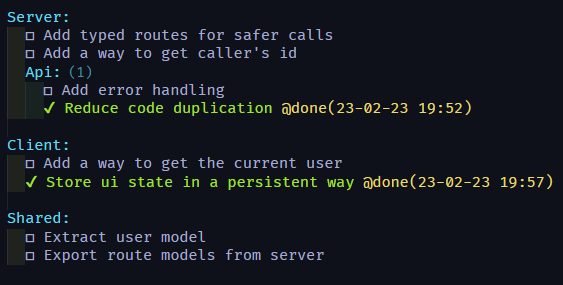
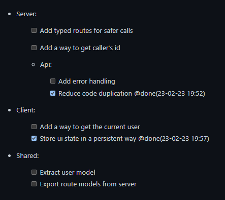

<div align="center" style="padding-bottom: 20px">
  
  
  [](https://github.com/Indeedornot/todo-to-markdown/actions/workflows/test.yml)
  [](https://github.com/Indeedornot/todo-to-markdown/actions/workflows/check-dist.yml)
  [](https://github.com/Indeedornot/todo-to-markdown/actions/workflows/codeql-analysis.yml)
  [](https://wakatime.com/badge/user/ef2a734e-dc42-48cf-b3f4-6c60b675d517/project/d3d00164-ecd4-441b-a0e9-c3258c91eff3)

</div>

If you use [Todo+](https://github.com/fabiospampinato/vscode-todo-plus) for tracking your TODOs - You can use this action to automatically add them to a roadmap in your README in form of a markdown list.

## Sample

| Todo                      | Markdown                     |
| ------------------------- | ---------------------------- |
|  |  |

## Roadmap

<!-- start: readme-segment -->
<!-- end: readme-segment -->

## Usage

1. Add the following segment to your README file where you want your todo to appear:

   ```text
   <!-- start: readme-segment -->
   <!-- end: readme-segment -->
   ```

2. Click **Action** tab and choose **Set up a workflow yourself**.
3. Copy the following code into the opened file

   ```yaml
   name: Todo+ Roadmap

   on:
     push:
       paths:
         - 'TODO'
     pull_request:
       paths:
         - 'TODO'
     # Allow manual trigger
     workflow_dispatch:

   permissions:
     contents: write

   jobs:
     update:
       name: Update Todo in Readme
       runs-on: ubuntu-latest
       steps:
         # Use indeedornot/todo-to-markdown@<latest-release-tag> for latest stable release
         - uses: indeedornot/todo-to-markdown@main
           with:
             # Automatic github token
             GH_TOKEN: ${{ secrets.GITHUB_TOKEN }}
             # Branch - older GitHub repositories have "master" as default branch, uncomment if that's the case
             #BRANCH: "master"
   ```

- Now every time you update your TODO file, your README will be updated with the latest todos.
